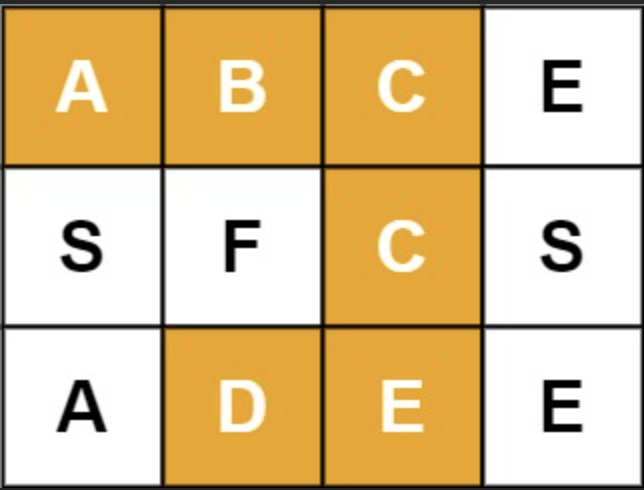

## 79. Word Search

🔗 [Link](https://leetcode.com/problems/word-search/description/)

**📝 Topic: Backtracking, DFS**

Given an m x n grid of characters board and a string word, return true if word exists in the grid.

The word can be constructed from letters of sequentially adjacent cells, where adjacent cells are horizontally or vertically neighboring. The same letter cell may not be used more than once.

Example 1:

Input: board = [["A","B","C","E"],["S","F","C","S"],["A","D","E","E"]]

word = "ABCCED"

Output: true

----

### Understand
_Verify the constraints and ask questions. Can also go through some test case_

1. Can the input board or word be empty?
No, the smallest board would be 1 row and 1 column ; the shortest word would be 1 character long
2. Is the word length possibly longer then board? Yes
3. Can a character visit twice? No, The same letter cell may not be used more than once.

### Match
_See if this problem matches any data structures, algorithms_

Backtracking:

Backtracking is a general way to search through possibilities while respecting constraints. Think of it as: try a choice, explore deeper, and if it fails, undo the choice and try the next one.

### Plan
_Walk through a implementation with an existing diagram_

**Approach**

Use DFS with backtracking. From each cell that matches word[cur], try the 4 neighbors. Mark the current cell as visited, explore, then restore it before returning.

- Outer loops: try every cell as a starting point. Return true as soon as any DFS finds the whole word.
- DFS recursion: (i, j, cur) where cur is the index in word.
  - Base case: if **cur == word.length()**, all characters matched, return true.
  - Checking: if out of bounds, character mismatch, or cell already used in this path ('#'), return false.
  - Choose: temporarily mark board[i][j] = '#' to prevent reuse in this path.
  - Explore: recursively search 4 directions with cur + 1.
  - Unchoose: restore the character with board[i][j] = word.charAt(cur) because it matched earlier.
  - Return: OR of the 4 recursive calls.
 

### Implement
_See the code file_

### Review
_Go throgh the code step by step with examples and check any mistakes_

### Evaluate

m = rows, n = cols, L = word length.

Time Complexity: O(n * m * 3^(L-1)) = O(m·n·3^L) The choices are reduced into 3 (since we won't go back to where we come from)

Space Complexity: O(L) Recursion depth is at most L
